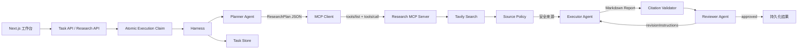

# AgentOS

[](https://github.com/ZQR1101/agentos-web/actions/workflows/ci.yml)

一个面向 Agent 开发实习作品集的可控调研 Agent。它不是普通聊天页面，而是一个包含真实多 Agent 协作、网页检索、人工审批、任务持久化和执行追踪的 Agent Runtime 原型。

## 项目亮点

- **真实 Multi-Agent**：Planner 输出结构化 JSON 计划；Executor 调用 Tavily 检索并基于来源写报告；Reviewer 独立评分和提出修订要求。
- **真实 MCP 接入**：Research MCP Server 使用官方 TypeScript SDK 暴露 `search_web`；Harness 通过 MCP Client 完成初始化、工具发现和工具调用，并对瞬时空结果执行有限指数退避重试。
- **真实 Skill Registry**：`research-report` 与 `source-review` 是带版本、输入输出契约、工具声明和可执行方法的能力包；后端与 Skills 页面读取同一份注册表，任务持久化实际 Skill 版本。
- **默认拒绝的 Tool Policy**：工具页与 Harness 共享注册表；未注册、禁用、作用域不符或缺少明确审批的工具调用都会被拒绝。目前只开放只读 `agentos-research/search_web`。
- **运行环境健康检查**：工作台只显示 Key 是否配置、当前模型与远程 MCP 是否启用，不暴露任何密钥；缺少 DeepSeek/Tavily 时会在审批前阻止执行。
- **真实 Harness 预算**：每个外部动作在执行前统一扣减步骤、模型调用和工具调用预算，同时检查总耗时；超限立即失败关闭，不依赖 Prompt 自觉停止。
- **受控 Agent Loop**：Reviewer 未通过时由 Harness 触发一次修订；默认最多 8 个外部步骤、5 次模型调用、3 次工具调用和 180 秒，避免无限循环与失控消耗。
- **幂等执行与并发保护**：Harness 通过原子状态转换获取唯一执行权；重复请求复用运行中或已完成的任务，不会重复产生模型与搜索费用。
- **Human-in-the-loop**：外部搜索和模型调用前必须获得用户批准，任务可在审批节点暂停和恢复。
- **可验证来源**：报告只能依据搜索摘要生成，并展示可点击的原始网页链接。
- **来源安全与多样性策略**：对候选来源执行 URL 校验、去重、质量评分和提示注入特征检测；高风险内容在进入模型上下文前被隔离，同一域名最多保留 2 个来源，减少单一厂商立场主导报告的风险。
- **双层质量门禁**：Reviewer 负责语义质量，Harness 程序化核对引用编号、原始 URL 和未授权外链，任一检查失败都会触发修订或终止。
- **确定性引用渲染**：Writer 只输出 `[来源 N]`；服务端按来源编号生成最终 URL，并移除模型输出的其他外链，避免模型手抄链接破坏白名单。
- **安全评测门禁**：CI 运行 10 个来源策略样本和 5 个引用完整性用例；当前回归集的高风险拒绝召回率与可用来源保留率均为 100%。
- **任务持久化**：Task、Plan、Sources、Report、Review 和 Events 保存至 `.data/tasks.json`，刷新后仍可恢复。
- **可观测性**：记录 Agent 交接、当前步骤、Reviewer 分数、执行轮数、失败原因和模型响应 ID。
- **实时运行快照**：工作台每 1.5 秒同步持久化状态，展示当前 Agent、MCP 调用、Reviewer 修订、执行 ID 与耗时；运行记录页每 3 秒自动刷新。

## 架构



## 执行流程

1. 用户创建任务，服务端生成 Task 并保存。
2. 系统停在审批节点；用户可以批准、暂停或稍后恢复。
3. Harness 原子地将 Task 从待审批切换为执行中并写入 `executionId`；并发请求只能复用已有执行。随后启用预算执行器，每次外部动作前先持久化授权和用量。
4. Planner 将目标转换为 `searchQuery`、`subquestions` 和 `successCriteria`。
5. Harness 与 Research MCP Server 建立连接，执行 `tools/list` 发现 `search_web`，再通过 `tools/call` 发起搜索。
6. MCP Tool 调用 Tavily 获取候选来源；瞬时空结果最多重试 3 次，并记录实际尝试次数；Source Policy 校验 URL、清洗摘要、检测提示注入并按质量排序，最多保留 6 个来源。
7. Executor 将来源作为不可信数据隔离后交给 DeepSeek，生成带引用的 Markdown 报告。
8. Harness 先程序化校验引用编号、URL 和外链白名单，再由 Reviewer 返回结构化审核结果。
9. 任一质量门禁未通过时最多修订一次；通过后保存报告、执行 ID、MCP 调用轨迹、Harness 预算结算、来源评分和完整事件记录。

单次任务至少调用 DeepSeek 3 次；触发修订时最多调用 5 次。

## 技术栈

- Next.js 16、React 19、TypeScript、Tailwind CSS
- DeepSeek OpenAI-compatible Chat Completions API
- Tavily Search API
- Model Context Protocol TypeScript SDK 1.29（InMemory + Streamable HTTP）
- React Markdown + GFM
- 本地 JSON Task Store（可替换为 SQLite/PostgreSQL）

## 本地运行

```bash
npm install
Copy-Item .env.example .env.local
npm run dev
```

在 `.env.local` 配置：

```env
DEEPSEEK_API_KEY=你的密钥
DEEPSEEK_MODEL=deepseek-v4-flash
TAVILY_API_KEY=你的密钥
# 可选：启用带认证的远程 MCP Endpoint
MCP_ACCESS_TOKEN=一段足够长的随机值
MCP_ALLOWED_HOSTS=localhost:3000,127.0.0.1:3000
```

打开 `http://localhost:3000`。不要提交 `.env.local` 或在截图、Issue 中暴露完整密钥。

## 主要目录

```text
src/app/api/tasks/       Task 创建、查询、暂停、恢复与重试
src/app/api/research/    Multi-Agent Loop 与外部工具调用
src/app/api/mcp/research 标准 Streamable HTTP MCP Endpoint
src/lib/harness-budget  步骤、模型、工具与耗时预算执行器
src/lib/mcp/             Research MCP Server 与 Harness Client
src/lib/skills/          版本化 Skill 定义、契约、执行器与注册表
src/lib/tool-policy.ts   默认拒绝的工具注册与授权策略
src/lib/task-store.ts    本地任务持久化
src/lib/source-policy.ts 来源评分、提示注入检测与引用校验
evals/                   Source Policy 标签样本与离线评测脚本
src/components/ChatBox   工作台和审批交互
src/components/RunsList  真实运行记录
src/types/task.ts        Agent 结构化交接协议
```

## 验证

```bash
npm run lint
npm run test:mcp
npm run test:store
npm run test:harness
npm run test:skills
npm run test:tools
npm run test:health
npm run eval:safety
npm run build
```

## 当前边界

- JSON Task Store 使用进程内写锁与临时文件原子替换，能够处理单进程并发；它仍不适合多实例或 Serverless 生产部署。
- UI 已通过轮询展示持久化进度，但执行 API 仍是同步请求；生产版本应使用任务队列、SSE 和可取消的后台 Worker。
- 当前 Source Policy 是启发式规则，生产版本还应增加域名信誉库、发布时间校验、内容抓取验证和专门的安全评测集。
- 当前 100% 指标仅针对仓库内 10 个小型合成/回归样本，不代表开放网络上的泛化安全性。
- 远程 MCP 默认关闭；只有同时配置访问令牌和 Host Allowlist 才能开放，避免公开消耗 Tavily 配额。

## 下一步

1. 将 Task Store 替换为 PostgreSQL，并使用事务、唯一约束和分布式执行租约保证多实例幂等性。
2. 使用后台 Worker + SSE，实现执行中暂停、取消和实时步骤更新。
3. 将 Source Policy 评测扩展到真实网页、混淆注入、多语言变体与人工标注数据。
4. 增加动态 Tool Registry，支持多个 MCP Server 的连接、权限与健康检查。

面试演示流程和简历描述见 [`docs/INTERVIEW.md`](docs/INTERVIEW.md)。
